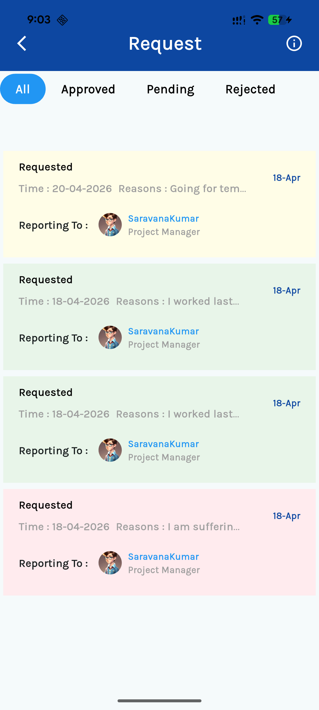

# 📅 Leave Tracker Application

A modern, high-performance Flutter application designed to streamline employee leave management with a premium UI/UX, real-time tracking, and automated notification systems.


---

## ✨ Key Features

- **🚀 Intuitive Dashboard**: Quick access to all leave-related tasks and real-time status updates at a glance.
- **📝 Seamless Leave Application**: Effortlessly apply for various leave types including Earned Leave, Casual Leave, and Permissions with an integrated date picker and reasoning system.
- **📊 Detailed Leave Summary**: Visual breakdown of available vs. booked leave categories (Bereavement, Casual, Earned, etc.).
- **📂 Request History**: Comprehensive tracking of all requests with status-based filtering (All, Approved, Pending, Rejected).
- **🔔 Notification Engine**: Integrated notification system to keep users informed about their request progress and approvals.
- **🔐 Secure Authentication**: Built-in login and registration system for secure employee access.

---

## 📸 App Screenshots

````carousel

<!-- slide -->

<!-- slide -->

<!-- slide -->

<!-- slide -->

````

---

## 🛠️ Tech Stack

- **Framework**: [Flutter](https://flutter.dev) (Current stable)
- **State Management**: [Riverpod](https://riverpod.dev) - For scalable and testable state control.
- **Database**: [SQLite](https://pub.dev/packages/sqflite) - Robust local data persistence.
- **Styling**: Google Fonts (Karla) & Custom Material Design components.
- **Notifications**: Flutter Local Notifications for real-time alerting.
- **Utilities**: `timezone`, `intl`, `dio` for networking/formatting.

---

## 🏗️ Project Architecture

The project follows a clean architecture pattern within the `lib/src` directory:

- **Data**: Repositories and Data Sources (Local/Remote).
- **Presentation**: UI Views, Widgets, and State Notifiers.
- **Domain**: Business Logic and Models (Entities).
- **Utils**: Helpers for date parsing, constants, and extensions.

---

## 🚀 Getting Started

### Prerequisites

- Flutter SDK (>= 3.38.4)
- Android Studio / VS Code
- Java 21 (for Android builds)

### Installation

1. **Clone the repository**
   ```bash
   git clone https://github.com/saravanan-sarav/leave_tracker_application_flutter.git
   ```

2. **Install dependencies**
   ```bash
   flutter pub get
   ```

3. **Handle Build Dependencies (Windows)**
   If you are on Windows, ensure **Developer Mode** is enabled to allow symlinks for plugins.

4. **Run the application**
   ```bash
   flutter run
   ```

---

## 👨‍💻 Contributor

**Saravanan S**
- Role: Lead Developer
- Department: Banking Intern

---

> [!NOTE]
> This application is optimized for Android 16 (API 36) and utilizes Core Library Desugaring for broad device compatibility.
